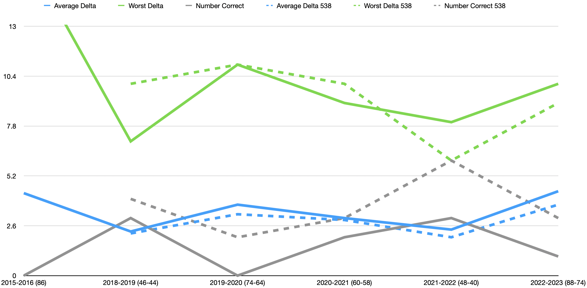

# pl-predictor

## About
[pl-predictor](https://github.com/bealonso2/pl-predictor) is an ongoing project to try and predict the outcome of the Premier League more accurately than my friends.

I started in 2020 to try and improve my python skills and learn more about data science. While my python skills have improved, I have a long way to go with predicting the results of the Premier League.

## 2023-2024 Predictions 🔮

|   Position | Team                     |
|-----------:|:-------------------------|
|          1 | Manchester City          |
|          2 | Arsenal                  |
|          3 | Manchester United        |
|          4 | Liverpool                |
|          5 | Newcastle United         |
|          6 | West Ham                 |
|          7 | Chelsea                  |
|          8 | Tottenham Hotspur        |
|          9 | Brighton and Hove Albion |
|         10 | Brentford                |
|         11 | Fulham                   |
|         12 | Burnley                  |
|         13 | Aston Villa              |
|         14 | Crystal Palace           |
|         15 | Wolverhampton Wanderers  |
|         16 | Everton                  |
|         17 | Nottingham Forest        |
|         18 | Luton                    |
|         19 | Sheffield United         |
|         20 | Bournemouth              |

### Other predictions

#### Premier League Awards

- Golden Boot: Erling Haaland
- Golden Glove: Alison Becker
- Most Assists: Kevin De Bruyne
- Manager of the Season: Pep Guardiola
- Young Player of the Season: Bakayo Saka

#### Continental Trophies

- Champions League: Arsenal
- Europa League: Atletico Madrid
- Europa Conference League: Eintracht Frankfurt

## Results

Here is how I've done so far:

The dashed lines represent the 538 predictions, which I hold to be the gold standard. My goal is to beat them (in addition to my friends).

Read: Season (my number of positions different, 538 number of positions different)
